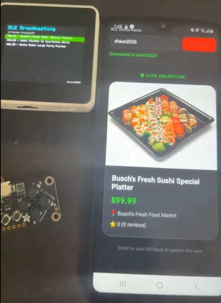
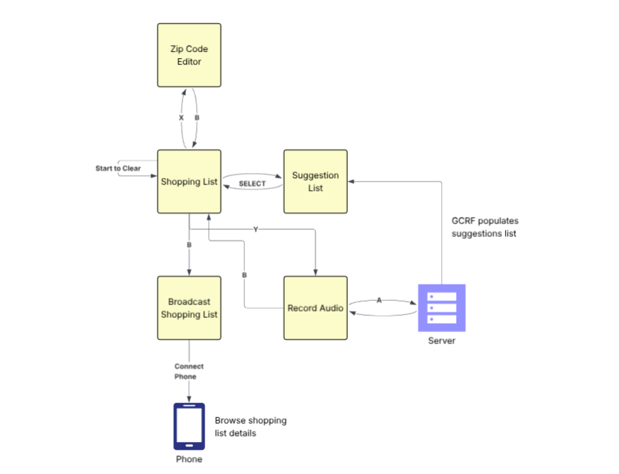

# SmartShopper

SmartShopper is a voice-assisted shopping system that turns a spoken request into location-aware product suggestions. It combines an M5Stack Core2 device, a cloud processing service, and a React Native mobile client.

## Demo



## High-level architecture



The system is composed of three main layers:

### 1. M5Stack Core2 device

The M5Stack provides the hardware interface for the shopper. Its firmware:

- Captures a voice request using the built-in microphone.
- Saves the recording as a WAV file on the SD card.
- Collects the user's ZIP code.
- Sends the recording and ZIP code to the cloud service over Wi-Fi.
- Displays returned products and shopping suggestions on the device.
- Broadcasts selected products over Bluetooth Low Energy (BLE).

The device includes screens for recording audio, editing the ZIP code, reviewing suggestions, managing the shopping list, and starting BLE broadcasting.

### 2. Cloud processing service

The `SmartShopperGCRF` directory contains a Node.js Google Cloud Function. It acts as the backend between the hardware and external services.

When the function receives a request, it:

1. Validates the HTTP method, ZIP code, and WAV file.
2. Sends the audio to OpenAI for transcription.
3. Converts the transcription into three to five structured shopping queries using an OpenAI model.
4. Converts the ZIP code into a location.
5. Searches Google Shopping through SerpApi for each suggested item.
6. Combines the product information into a JSON response.

The response includes information such as product name, price, store, rating, review count, distance, product link, and image URL.

### 3. React Native mobile client

The `SmartShopperReactNative` directory contains the Expo/React Native application. The app connects to the M5Stack using BLE, listens for product notifications, and presents the shopping information in a mobile interface.

## End-to-end data flow

```text
User speaks a shopping request
              │
              ▼
       M5Stack Core2 records audio
              │
              ▼
    WAV + ZIP code sent over Wi-Fi
              │
              ▼
       Google Cloud Function
              │
       ┌──────┼───────────────┐
       ▼      ▼               ▼
   OpenAI  Location       SerpApi
 transcription lookup   Google Shopping
       └──────┼───────────────┘
              ▼
      Product results as JSON
              │
              ▼
   M5Stack displays suggestions
              │
              ▼
 Selected products sent over BLE
              │
              ▼
     React Native mobile app
```

## How the device is used

1. The shopper records a request, such as a list of items they need.
2. The M5Stack saves the recording and sends it to the backend.
3. The backend identifies the requested products and finds nearby or location-relevant shopping results.
4. The M5Stack displays the returned suggestions.
5. The shopper selects products to add to their shopping list.
6. The shopper can start BLE broadcast mode to send the selected product information to the mobile app.

## Repository structure

| Directory | Description |
| --- | --- |
| [`SmartShopperM5`](SmartShopperM5) | C++ PlatformIO firmware for recording audio, handling input, displaying results, communicating over Wi-Fi, and broadcasting over BLE. |
| [`SmartShopperGCRF`](SmartShopperGCRF) | JavaScript Google Cloud Function for transcription, query generation, location lookup, and product search. |
| [`SmartShopperReactNative`](SmartShopperReactNative) | TypeScript/React Native mobile application for receiving and displaying BLE product data. |
| [`images`](images) | Architecture and demonstration images for the project documentation. |
